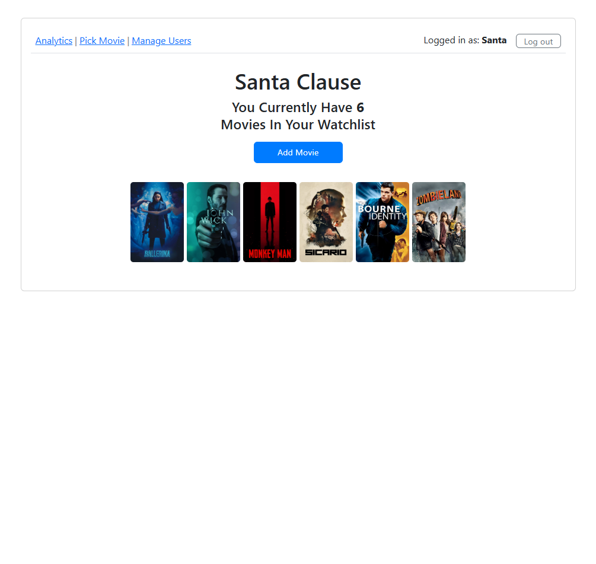
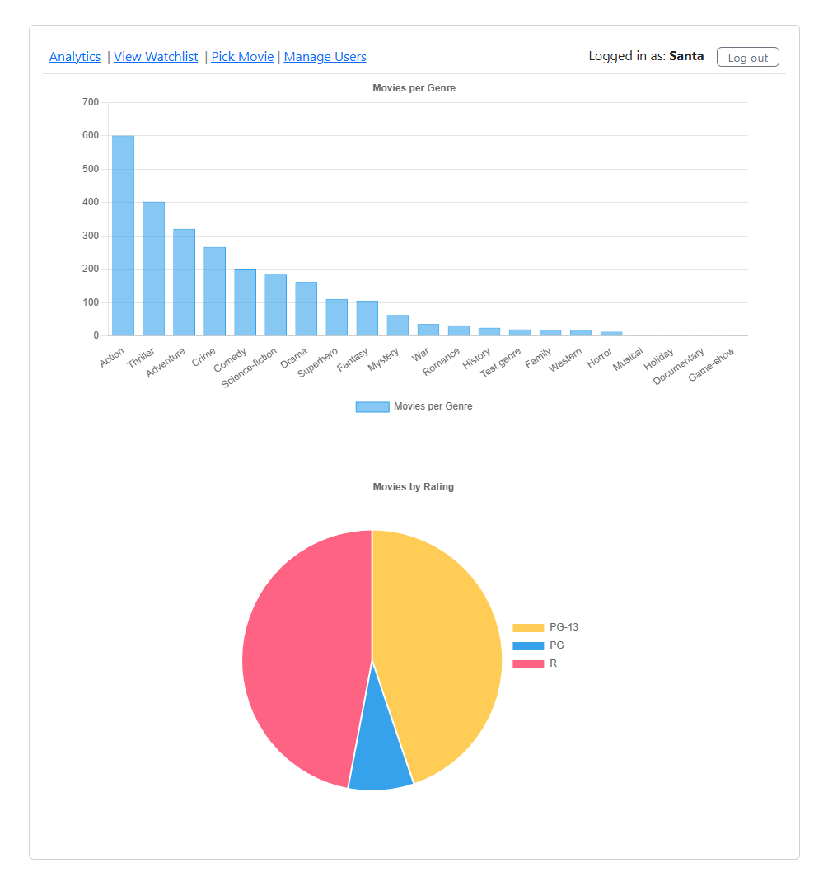
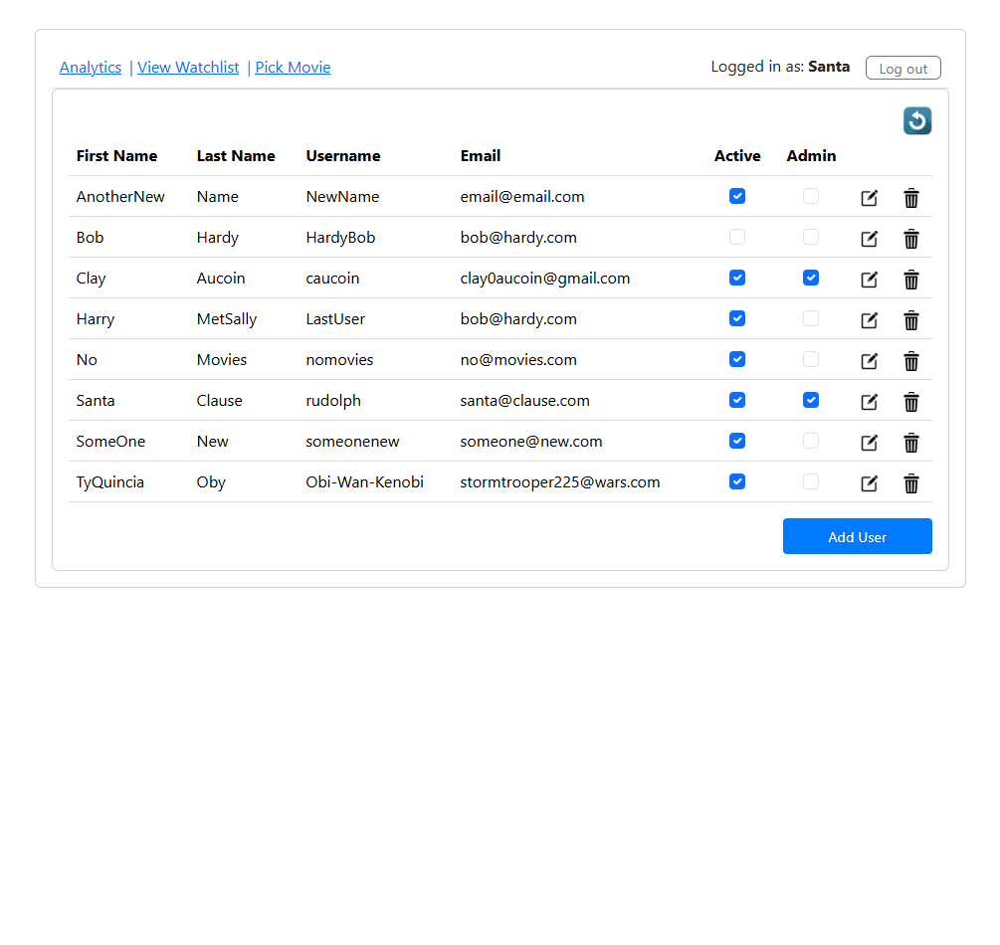
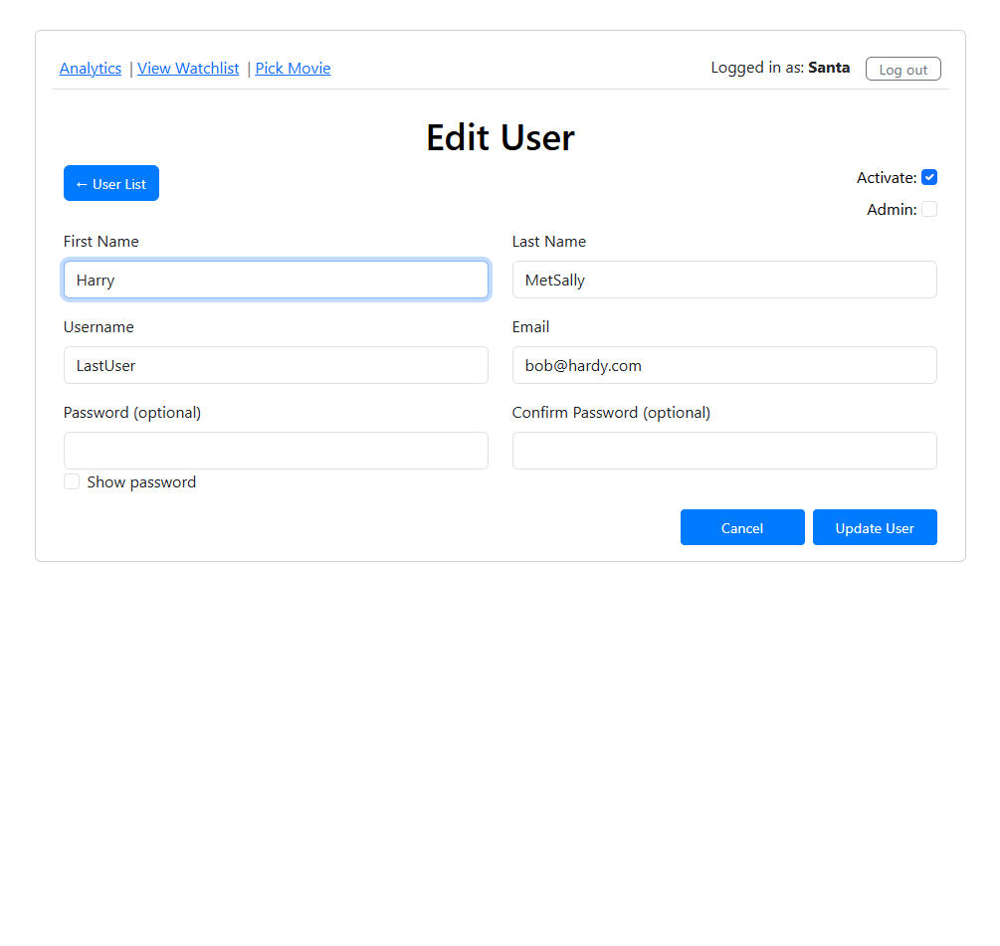

# Movie Catalog App

   

## Table of Contents

- [Overview](#overview)
- [Purpose](#purpose)
- [Screenshots](#screenshots)
- [Features](#features)
- [Tech Stack](#tech-stack)
- [Database Schema](#database-schema)
- [Setup Instructions](#setup-instructions)
- [Usage](#usage)
- [Folder Structure](#folder-structure)
- [Key Components](#key-components)
- [Future Improvements](#future-improvements)
- [Author](#author)
- [License](#license)

---

## Overview

This is a full-stack **React + Supabase** web app that allows users to browse a catalog of movies, view detailed info and trailers, manage a personal watchlist, view analytics on genres and ratings and handle user accounts with integrated login and admin tools. It features a responsive layout, authentication system, user management, and chart-based insights.

---

## Purpose

The app was designed as a Capstone project to demonstrate the integration of React and Supabase for real-time CRUD operations, user authentication, and data visualization.

---

## Screenshots

<table width="100%" border="0">
  <tr>
    <td width="50%">
      
    </td>
    <td width="50%">
      
    </td>
  </tr>
  <tr>
    <td width="50%">
      
    </td>
    <td width="50%">
      
    </td>
  </tr>
  <tr>
    <td width="50%">
      
    </td>
    <td width="50%">
      
    </td>
  </tr>
</table>

---

## Features

### Movie Library

- Displays all movies in a responsive grid by genre.
- Each movie has a detailed view page with poster, trailer,
  description, and cast info.
- Layout automatically adapts between desktop and mobile.

### User Authentication

- Custom login/logout system using Supabase and localStorage.
- Authenticated sessions persist across refreshes.
- Displays logged-in user in Navbar.
- Role-based access (Admin and Non-admin users)
- Manage user accounts (Admin only)

### Watchlist Management

- Personalized watchlist for each user.
- Add/remove movies directly from the movie detail page.
- Highlights movies already on the user's watchlist.

### Admin Features

- Manage users: add, edit, delete, and activate/deactivate accounts.
- Confirmation modals for sensitive actions.
- Filter and refresh functionality for user list.

### Responsive Layout

- Poster resizes dynamically with the viewport.
- Trailer uses a responsive YouTube embed.
- Stacks poster > trailer > description > details on small screens.

### Analytics

- Analytics page with:
  - Bar chart: Movies per Genre
  - Pie chart: Movies per Rating

---

## Tech Stack

- **React (Vite)** -- fast front-end framework
- **React Router** -- page routing and navigation
- **Supabase** -- backend-as-a-service for database and auth
- **Bootstrap 5** -- UI layout and components
- **YouTube Embed API** -- responsive trailers
- **PostgreSQL** -- data persistence and relations

---

## Database Schema

### `movies` Table

| Column                      | Type    | Description                |
| --------------------------- | ------- | -------------------------- |
| id                          | bigint  | Primary key                |
| imdb_id                     | text    | Unique IMDB identifier     |
| title                       | text    | Movie title                |
| year                        | integer | Release year               |
| genres                      | text    | Comma-separated genre list |
| poster                      | text    | Poster image URL           |
| yt_trailer_id               | text    | YouTube trailer ID         |
| runtime                     | text    | Duration (e.g., 2:10:35)   |
| rating                      | text    | MPAA rating                |
| description                 | text    | Movie summary              |
| producers, directors, stars | text    | Credits                    |
| budget, worldwide_gross     | numeric | Financial data             |

### `users` Table

| Column                | Type    | Description        |
| --------------------- | ------- | ------------------ |
| id                    | bigint  | Primary key        |
| first_name, last_name | text    | User’s name        |
| username              | text    | Login name         |
| password              | text    | Hashed password    |
| email                 | text    | Contact email      |
| is_active             | boolean | Active status      |
| is_admin              | boolean | Admin privileges   |
| user_id               | uuid    | FK to `auth.users` |

### `watchlist` Table

| Column  | Type   | Description            |
| ------- | ------ | ---------------------- |
| user_id | bigint | FK to `users`          |
| imdb_id | text   | FK to `movies.imdb_id` |

---

## Setup Instructions

### 1️ Clone the repository

```bash
git clone https://github.com/ClayAucoin/lv3-capstone
cd lv3-capstone
```

### 2️ Install dependencies

```bash
npm install
```

### 3️ Configure environment variables

Create a `.env` file in the project root:

```bash
VITE_SUPABASE_URL=your-supabase-url
VITE_SUPABASE_ANON_KEY=your-supabase-anon-key
```

### 4️ Run locally

```bash
npm run dev
```

### 5. Open [http://localhost:5173](http://localhost:5173) in your browser.

---

## Usage

- Log in or register a new user.
  - Default admin:
    - username: **admin**
    - password: **password**
- Browse movies by genre or open individual movie pages.
- Click **Add to Watchlist** to save a movie or **Remove from Watchlist** to delete it.
- Admin users can access the **Manage Users** page to edit, add, or delete users.
- Visit the **Analytics** page to view charts showing movies by genre and rating.

---

## Folder Structure

    src/
    ├── components/
    │   ├── media/
    │   │   ├── movieContent/
    │   │   │   ├── MovieClip.jsx
    │   │   │   ├── MovieDescription.jsx
    │   │   │   ├── MoviePoster.jsx
    │   │   │   ├── MovieStats.jsx
    │   │   │   └── MovieTrailer.jsx
    │   │   ├── Analytics.jsx
    │   │   ├── MovieView.jsx
    │   │   ├── PickMovie.jsx
    │   │   └── ViewWatchlist.jsx
    │   ├── user/
    │   │   ├── AddUser.jsx
    │   │   ├── EditUser.jsx
    │   │   ├── ManageUsers.jsx
    │   │   └── UserForm.jsx
    │   ├── LoginPage.jsx
    │   ├── Navbar.jsx
    │   └── NoticeModal.jsx
    ├── context/
    │   ├── AuthContext.jsx
    │   └── ModalContext.jsx
    ├── routes/
    │   └── ProtectedRoute.jsx
    ├── utils/
    │   └── supabase.js
    └── App.jsx

---

## Key Components

### AuthContext.jsx

Provides app-wide authentication context. Manages login, logout, and
session state with localStorage and Supabase.

### ManageUsers.jsx

Displays and manages user records from Supabase. Includes refresh, edit,
delete, and confirmation modals.

### MovieView.jsx

Responsive movie detail page with poster, trailer, description, and
metadata.

### MovieClip.jsx

Responsive YouTube trailer embed using `react-youtube` and CSS aspect
ratio for scaling.

### supabase.js

Configures Supabase client connection using your environment variables.

---

## Future Improvements

- Administrators can view other users' watchlist.
- Improve UI with filtering and sorting options.
- Hover effects for poster overlays.
- Add search functionality and genre filtering.
- Show watchlist and genre stats per user.
- Include analytics filtering by date range.
- Public vs. private watchlists.
- Each user can have multiple lists.
- Migrate to full Supabase Auth.
- Add movie ratings and comments.

---

## Author

**Clay Aucoin**\
Developer • Systems Enthusiast • Movie Data Wrangler\
Built with React, Supabase, and Bootstrap.

---

## License

Distributed under the [MIT License](LICENSE).
